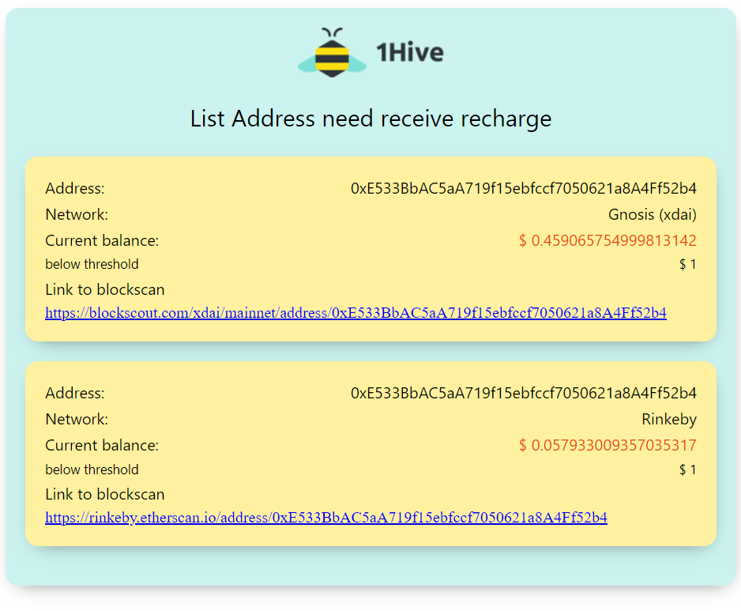

# Notify Low Balance
Small Cloud Functions to notify about low balance on the configured walllet address.



## Email Template
That service notify using the email service.

The template used you can find it here:

[Need Recharge Pug Template](./emails/recharge.pug)

[Need Recharge CSS ](./emails/styles.css)

It's use [email-templates](https://github.com/forwardemail/email-templates) that uses [pugjs](https://github.com/pugjs/pug) under the hood. 

Generating compatible email html to be send.

## Env Configurations

```
EMAIL_FROM_DEFAULT= #email address appears like sender
POSTMARK_SERVER_API_TOKEN= # token api to send emails
LIST_EMAIL_TO= # list of email to send the notifications
```

## Deploy

The Continuous Deployment (CD) is made by Google Build only when new tag version is created. (Tag name need match that regex: v*)

## Run the tests

1. Install dependencies:

        yarn install

1. Run the tests:

        yarn test
